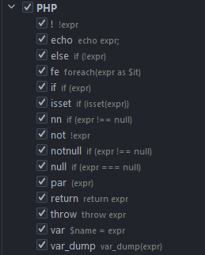

- глобальный поиск
    - shift+shift
        - движение по вкладкам tab
        - вкладка классы ctr + N
        - Активация/деактивация плагинов: в поиске прописать /plugins
- Перемещение по открытым вкладкам
    - Alt + вправо/влево
- Закрыть активную вкладку
    - Ctr + F4
- Переключение между вкладками и окнами
    - Ctr + tab
- Замена в тексте
    - Ctr + R
- Замена во всех файлах
    - ctr + shift + r
- Вернуться к последнему изменению
    - ctr + shift + backspace
- Открыть все недавние файлы
    - ctr + E
- Открыть только модифицированные файлы
    - ctr + E дважды
- Панель структуры файла
    - открыть: alt + 7
    - закрыть: shift + esc
- Перемещение по методам в классе
    - alt вверх/вниз
- Выделить одно/несколько слов
    - alt + j / ctr + alt + shift + j
- Провалиться в класс/интерфейс (если не используется алиас)
    - выделить нужный класс + ctr + B
- Списко всех классов/интерфейсов у выбранного класса
    - выделить нужный класс + ctr + U
- Рефакторинг кода в соответствии с code style настроенном в IDE
    - ctr + alt + l
- Рефакторинг кода в директории
    - правая кнопка мыши на директории + выбрать пункт Reformat code
- Оптимизация импортов
    - ctr + alt + o
- Перестановка кода (форматирование)
  - нажать shift + ctr + A и ввести rearrage? чтобы найти Rearrange Code action (кликнуть)
- Префикс автодополнение
  - при создании условия $flag.if + tab создастся блок с условием
  - при создание блока с return $flag.return + tab создается строка return $falg;
  - блок not null $flag.nn + tab
  - 
- Создать в классе constructor, test and so on
  - insert + alt выбираем constructor и добавляем shift + ctr свойства
